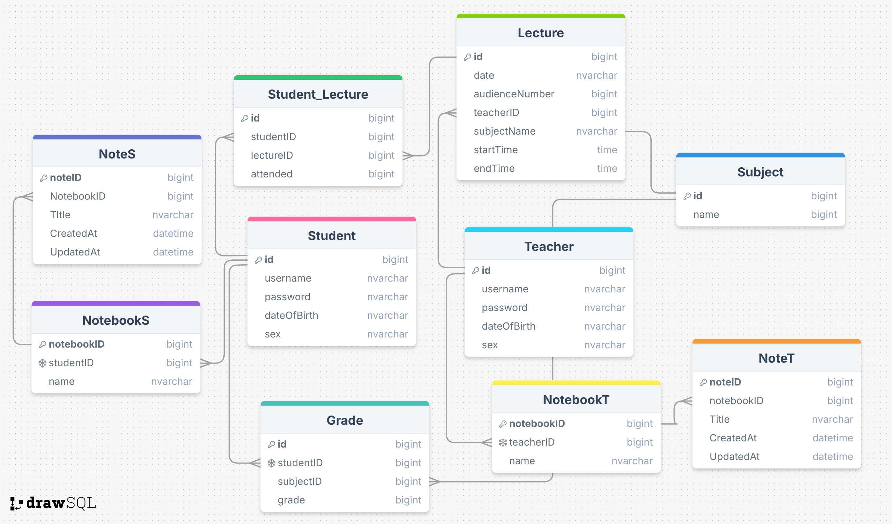

# "School Major" WPF Project
## Overview
This is a **WPF application** built using **C#** with the **MVVM architecture**. The project includes a **local database**, authentication features, a **text editor**, and **voice input** functionality.

## Features
- MVVM Architecture: Implements Model-View-ViewModel pattern for separation of concerns.
- Local Database: Uses Entity Framework for database management.
- Authentication System: Supports user login and authentication.
- Text Editor: A built-in text editor with essential editing functions.
- Voice Input & Text-to-Speech: Allows voice-to-text input for text fields and provides text-to-speech functionality.

## Project Structure
- `Diploma.WPF` – The main WPF application.
- `Diploma.Domain` – Contains domain models and business logic.
- `Diploma.EntityFramework` – Manages database interactions.
- `Diploma.sln` – The main Visual Studio solution file.

## Technologies Used
- **C# & .NET 7**
- **WPF (Windows Presentation Foundation)**
- **Entity Framework**
- **JWT Authentication**
- **Speech-to-Text & Text-to-Speech API**

## Interesting Methods & Implementations
Here are some notable methods and their purposes:

### Authentication
- `AuthenticateUser(string username, string password)`: Verifies user credentials using hashed passwords.
- `GenerateJwtToken(User user)`: Creates a JWT token for authenticated sessions.

### Database Management
The following database was created to manage key features of the program:

- `InitializeDatabase()`: Ensures database is properly set up and seeded with initial data.
- `SaveChangesAsync()`: Saves changes to the database asynchronously to improve performance.

### Text Editor Features
- `LoadTextFile(string filePath)`: Loads text content from a specified file.
- `SaveTextFile(string filePath, string content)`: Saves the current text content to a file.
- `FormatText(string style)`: Applies formatting (bold, italic, underline) to selected text.

### Voice Input & Text-to-Speech
- `StartVoiceRecognition()`: Activates the speech-to-text engine.
- `ProcessVoiceCommand(string command)`: Parses and executes voice commands.
- `ConvertTextToSpeech(string text)`: Uses a speech synthesis engine to read text aloud.

### MVVM Architecture
- `RelayCommand`: Implements command binding for buttons and UI actions.
- `OnPropertyChanged(string propertyName)`: Notifies the UI of property changes for dynamic updates.

## Database Dependency
This project is **database-sensitive** and will **not function without a local database**. Ensure that a properly configured local database is available before running the application.

## Security & Privacy
- **Sensitive data (passwords, API keys, connection strings) should be removed** before making this public.
- **Use environment variables** instead of hardcoded credentials.
- **_Ensure JWT tokens and authentication settings are secured_**.

## Contribution
Feel free to submit issues and pull requests. Contributions are welcome!

## License
This project is licensed under the MIT License (or specify the actual license used).

